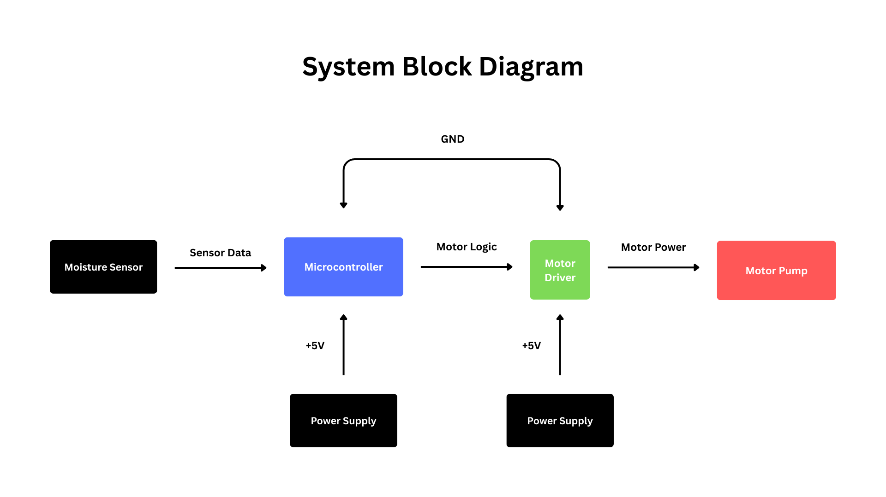

# Plant Watering Controller  
**Deterministic Embedded System with Timing Guarantees and Fault Handling**

## Overview
This project implements a deterministic, microcontroller-based plant watering system with explicit timing constraints, actuator safety limits, and fault detection/recovery logic.

The system periodically samples a soil moisture sensor, determines whether watering is required, and drives a pump through a motor driver. The design emphasizes:
- predictable timing behavior
- bounded actuator operation
- fault detection with latching and controlled recovery
- separation of monitoring vs actuation phases

This project was built to demonstrate **embedded systems engineering practices**, not just functional automation.

---

## System Architecture (High-Level)
- **Sensor**: Resistive soil moisture sensor (analog)
- **Controller**: Arduino (single-threaded, cooperative scheduler)
- **Actuator**: DC pump driven via L9110S motor driver
- **Control Model**: Periodic sampling with non-blocking state machine

The system alternates between **monitoring mode** (periodic sensing) and **watering mode** (actuation with enforced safety limits).

---

## System Block Diagram

The block diagram illustrates the high-level system architecture and the flow of data, control, and power between subsystems.  
It abstracts away physical wiring details and focuses on functional relationships between the sensor, controller, actuator, and power domain.

## Timing Specification

### Sampling Period
| Parameter | Value | Description |
|---------|------|------------|
| `T_sample` | 1,000,000 µs (1 s) | Period between soil moisture checks during monitoring |

### Execution Budget
| Parameter | Value | Description |
|---------|------|------------|
| `T_budget` | 500,000 µs (0.5 s) | Maximum allowed execution time for the sampling job |

If the sampling job exceeds `T_budget`, a **deadline miss** is recorded.

### Actuator Timing
| Parameter | Value | Description |
|---------|------|------------|
| `T_pump_max` | 1,000,000 µs (1 s) | Maximum continuous pump ON time |
| `T_settle` | 5,000,000 µs (5 s) | Settling delay after watering before resuming sampling |

During watering and settling, periodic sampling is **intentionally paused** (by design).

---

## Safety Guarantees

The system enforces the following safety constraints:

### Pump Safety
- The pump **cannot remain ON longer than `T_pump_max`**
- Pump control is non-blocking and time-bounded
- Pump is explicitly shut off on:
  - watering completion
  - fault entry
  - system reset (default LOW outputs)

### Monitoring Safety
- Sampling is suspended during watering and settling
- Schedule misses are only counted during monitoring mode
- Sensor readings are validated before use

These guarantees prevent runaway actuation and undefined behavior.

---

## Fault Handling

Faults are **latched**, meaning the system remembers that a fault occurred and does not immediately resume normal operation.

### Fault Confirmation
A fault is only entered after **multiple consecutive invalid samples** to avoid reacting to transient noise.

| Parameter | Value |
|---------|------|
| `FAULT_CONFIRM_COUNT` | 3 consecutive invalid samples |
| `RECOVERY_CONFIRM_COUNT` | 5 consecutive valid samples |

---

## Fault Table

| Fault | Detection Condition | System Response | Recovery Condition |
|-----|--------------------|-----------------|-------------------|
| `SENSOR_INVALID` | Moisture reading outside valid range OR implausible delta across samples | Enter FAULT state, disable pump | N consecutive valid readings with stable delta |

---

## Fault Reproduction Guide

### Sensor Invalid Fault
**How to reproduce:**
1. Unplug the moisture sensor
2. Short or float the analog input
3. Introduce large, sudden moisture deltas (e.g. reinsert sensor abruptly)

**Expected behavior:**
- Fault is latched after `FAULT_CONFIRM_COUNT`
- Pump is disabled
- System remains in FAULT until recovery criteria are met

---

## Measured Results

### Sensor Ranges (Observed)
| Condition | ADC Range |
|--------|-----------|
| Air | ~450–460 |
| Dry Soil | ~440–440 |
| Wet Soil | ~190–200 |

*(Exact values depend on sensor orientation and soil composition.)*

### Execution Timing
| Metric | Observed |
|------|---------|
| Typical sample time | \< few hundred µs |
| Max sample time | Recorded dynamically |
| Deadline misses | Tracked at runtime |

### Schedule Behavior
- Schedule misses only recorded during monitoring
- Watering/settling time is intentionally excluded from schedule metrics

---

## Design Decisions (Rationale)

### Why sampling pauses during watering
Sensor readings during watering are unreliable due to:
- pump electrical noise
- transient soil saturation
- physical disturbance

Pausing sampling avoids false readings and misleading timing metrics.

### Why faults are latched
Single-sample faults are common with analog sensors. Latching prevents:
- fault flapping
- false recovery
- unstable system behavior

---

## Project Goals
This project was designed to demonstrate:
- real-time reasoning without an RTOS
- explicit timing guarantees
- safe actuator control
- robust fault handling
- clear separation of concerns (monitoring vs actuation)

---

## Future Improvements
- Capacitive moisture sensor for improved stability
- Separate motor power domain
- Hardware watchdog integration
- PCB-based implementation

---

## Build & Run
- PlatformIO + Arduino framework
- Target: Arduino Uno (or compatible)